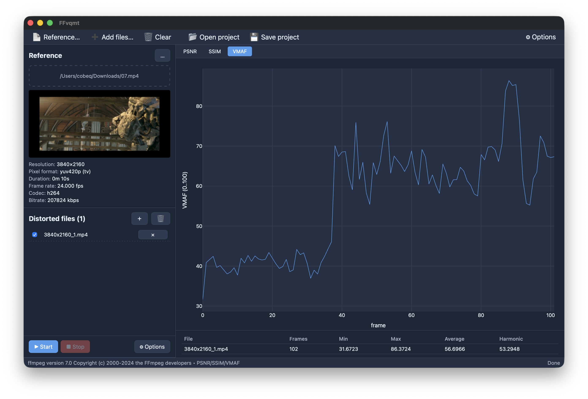

<h1 align="center">FFvqmt</h1>
<p align="center">
  <b>Fast Forward Video Quality Measurement Tool</b><br/>
  Cross-platform GUI for PSNR · SSIM · VMAF · XPSNR
</p>

<p align="center">
  <a href="LICENSE"></a>
  
  
  
</p>

<p align="center"></p>

A thin GUI on top of `ffmpeg` that batches PSNR / SSIM / VMAF / XPSNR over many distorted files against one reference and plots the result. No CLI gymnastics, no spreadsheets — drop files in, hit **Start**.

## Features

- **4 metrics**: PSNR, SSIM, VMAF, XPSNR
- **Batch**: up to 24 distorted files vs. one reference in a single pass
- **Interactive plots**: zoom, pan, export to SVG/PNG
- **CSV export**: per-frame and aggregate (Excel-friendly, tab-delimited)
- **Bad-frame extraction** to PNG for visual inspection
- **Auto VMAF model** selection from reference media info (in-built / JSON / PKL)
- **Drag & drop**, partial-range analysis, headless CLI mode
- No telemetry, no accounts, no ads

## Install

Grab a release from the [Releases page](../../releases) — bundles a static `ffmpeg` with `libvmaf` + `xpsnr`:

| OS | Artifact |
|---|---|
| Windows x64 | `FFvqmt-windows-amd64.zip` |
| Linux x64 | `FFvqmt-linux-amd64.tar.gz` / `.AppImage` |
| macOS arm64 | `FFvqmt-macos-arm64.dmg` |
| macOS x64 | `FFvqmt-macos-amd64.dmg` |

Unpack, run. That's it.

## Usage

GUI: pick a reference, drop distorted files, tick metrics, **Start**.

CLI:

```bash
FFvqmt [options] ref.mp4 dist1.mp4 [dist2.mp4 ...]
```

Common flags:

```
-metric=PSNR|SSIM|VMAF|XPSNR     repeatable; default: all
-run                             start calculation immediately
-exit                            quit when done
-skip=<sec>  -duration=<sec>     analyze a sub-range
-log-frames  -auto-save-results  CSV outputs
-ffmpeg-dir=<dir>                custom ffmpeg location
-project=<file.ffvqmtproj>       load saved project
-vmaf-model=<name>  -vmaf-pool=MEAN|HARMONIC_MEAN  -vmaf-subsample=N
```

Run `FFvqmt -help` for the full list.

## Build from source

Requires **Go 1.22+**, **Node 20+**, **[Wails v2](https://wails.io/)**.

```bash
go install github.com/wailsapp/wails/v2/cmd/wails@v2.9.2
cd frontend && npm install && cd ..

wails dev                                       # hot-reload
wails build -clean -trimpath -ldflags "-s -w"   # native release
```

Linux deps: `libgtk-3-dev libwebkit2gtk-4.1-dev libsoup-3.0-dev pkg-config build-essential`.
macOS deps: `xcode-select --install`.

Release artifacts are built by [`.github/workflows/release.yml`](.github/workflows/release.yml) on every `v*` tag.

## Architecture

```
main.go / app.go       Wails entry + bound methods
internal/ffmpeg        probe, command builder, output parsers
internal/metrics       orchestration runner
internal/project       .ffvqmtproj read/write
internal/csvlog        aggregate CSV append
internal/badframes     PNG extraction
frontend/              Vue 3 + TS + Pinia + Plotly
```

## Caveats

- Mismatched colour ranges between reference and distorted files will skew results — check stream metadata first.
- VMAF requires ffmpeg ≥ 4.3 built with `libvmaf`. Bundled builds already include it.
- Comparing a file against itself does **not** yield VMAF 100 — that's [by design](https://github.com/Netflix/vmaf/blob/master/resource/doc/faq.md).

## Contributing

PRs welcome. Keep them focused; `go test ./... && go vet ./...` and `npm run build` (in `frontend/`) must pass. Conventional Commits appreciated.

## License

[MIT](LICENSE). FFmpeg is invoked as an external process (LGPL/GPL, unaffected). Bundled VMAF models from [Netflix/vmaf](https://github.com/Netflix/vmaf) under BSD-2-Clause.
